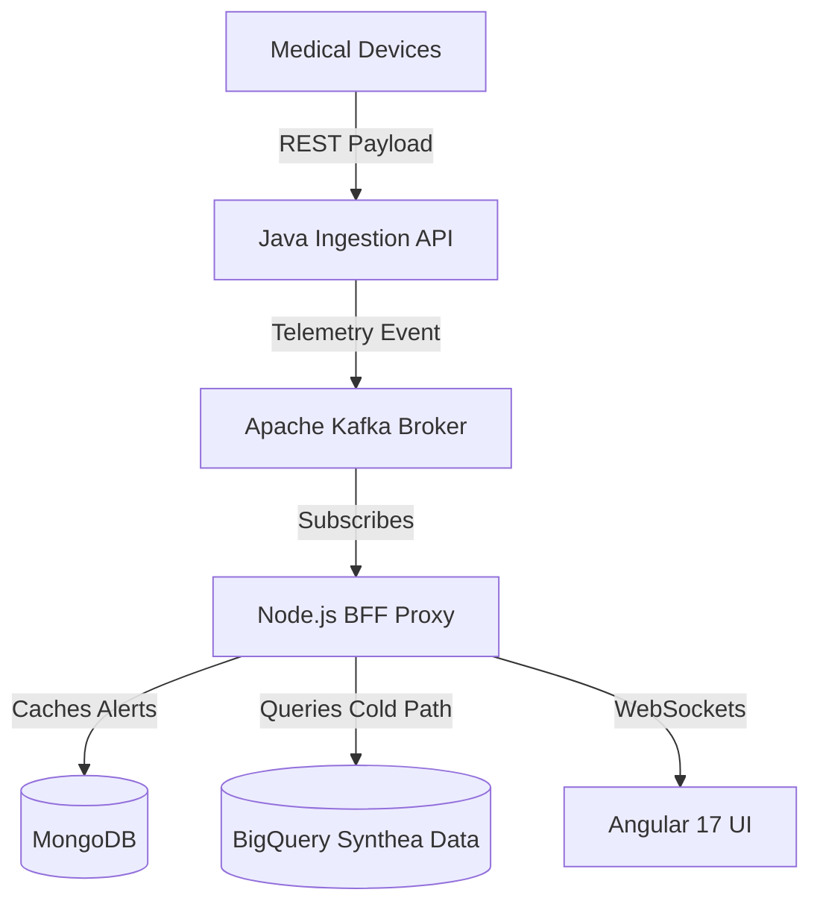

# Clinical Operations Command Center

[](#)
[](#)
[](#)
[](#)
[](#)

> An event-driven, containerized microservice architecture providing real-time medical hardware telemetry alongside predictive patient readmission analytics.

---

##  Project Intent

Hospital command centers require sub-second visibility into critical life-support equipment while simultaneously assessing long-term patient risk factors. This project bridges the gap between high-throughput transactional streams (Hot Path) and historical data warehouses (Cold Path). By intercepting real-time hardware maintenance alerts and instantly joining them with patient readmission models, clinical staff are empowered to make holistic, data-driven operational decisions without context switching.

##  Architecture as Code

The system utilizes a decoupled, containerized infrastructure, ensuring that high-volume hardware ingestion does not block UI rendering or analytical querying.



###  Technology Stack

| Layer | Technology | Purpose |
| :--- | :--- | :--- |
| Ingestion | Java Spring Boot | Validates and accepts REST telemetry payloads. |
| Message Broker | Apache Kafka | Queues and distributes events to decouple the architecture. |
| BFF Proxy | Node.js & Express | Bridges Kafka streams and REST APIs via WebSockets. |
| Cache | MongoDB | Stateful persistent storage for recent critical alerts. |
| Analytics | Google BigQuery | Enterprise data warehouse hosting synthetic patient records. |
| Client | Angular 17 | Standalone component-based UI for clinical staff. |
| Orchestration | Kubernetes (Minikube) | Manages container lifecycle, internal DNS, and self-healing. |

---

##  30-Second Quick Start

The infrastructure is entirely containerized. Ensure your local environment meets the prerequisites before provisioning the cluster.

### Prerequisites

| Requirement | Minimum Version | Note |
| :--- | :--- | :--- |
| Docker Engine | 24.0+ | Required for image building. |
| Minikube | Latest | Local Kubernetes cluster. |
| kubectl | 1.28+ | Kubernetes command-line tool. |
| Node.js | 20 LTS | Required for local UI development. |

1. **Build the Docker Images**
   ```bash
   docker build -t clinical-node-bff:v2 .
   cd clinical-client && docker build -t clinical-angular-ui:latest .
   ```
2. **Load Images into Minikube**
   ```bash
   minikube image load clinical-node-bff:v2
   minikube image load clinical-angular-ui:latest
   ```
3. **Apply the Manifests**
   ```bash
   kubectl apply -f k8s/
   ```
4. **Open the Network Tunnel**
   ```bash
   kubectl port-forward svc/node-bff-api 4000:4000
   ```
   The UI will now be available via minikube service angular-client.

---

##  Engineering Maturity: Technical Challenges & Decisions

### Resolving Cross-Cluster Communication
* **Situation:** During the migration from Docker Compose to Kubernetes, the Node.js consumer entered a CrashLoopBackOff, and the Angular UI was blocked by CORS policies.
* **Task:** Establish a secure, reliable communication tunnel between the isolated K8s pods and the external Kafka broker while bypassing Minikube's aggressive image caching.
* **Action:** Reconfigured the Express and Socket.io CORS policies to accept LoadBalancer origins. Replaced hardcoded localhost references with dynamic `host.minikube.internal:9092` internal DNS paths via Kubernetes deployment environment variables. Forced a clean pod reboot using a v2 image tag to invalidate the cache.
* **Result:** Eliminated CORS blockades and successfully established an end-to-end WebSocket stream with sub-second latency across the virtual network boundary.

### Architectural Decision Record (ADR): Implementation of a BFF
* **Status:** Accepted
* **Context:** The Angular client required both real-time streaming data (Kafka) and historical analytics (BigQuery), which operate on entirely different protocols.
* **Decision:** Introduce a Node.js Backend-For-Frontend (BFF) proxy layer instead of connecting the UI directly to the data sources.
* **Consequences:**
    * **Positive:** Secures Google Cloud Service Account credentials away from the client browser. Unifies WebSockets and REST APIs into a single data stream for the frontend.
    * **Negative:** Adds a network hop and requires managing an additional deployment container within the Kubernetes cluster.

---

##  Analytics Integration: Predictive Readmission

The "Cold Path" of this application retrieves demographic and diagnostic data generated by the Synthea model. The system flags 30-day readmission risks to help triage patients tied to failing hardware.

The underlying machine learning model evaluates the probability of readmission $P$ using a logistic regression algorithm based on weighted patient variables $X$:

$$P(\text{Readmission}|X) = \frac{1}{1 + e^{-(\beta_0 + \beta_1X_1 + \beta_2X_2 + ... + \beta_kX_k)}}$$

This integration ensures that maintenance alerts are never viewed in a vacuum, providing clinical context to mechanical failures.

---
